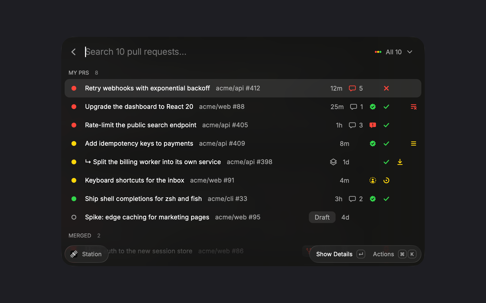

# Station for Raycast

Where each of your pull requests stands, at a glance, and one key to review it in [Station](https://github.com/timmywheels/station).



## Reading a row

The dot on the left is the PR's own light:

- **Red, needs you**: CI failed, changes requested, conflicts, dropped from the merge queue, or unresolved review threads
- **Yellow, waiting**: CI running, review pending, in the merge queue, or behind its base
- **Green, ready**: CI passed and nothing is waiting
- **Purple check, merged**: red if the base branch is still failing after the merge

Drafts are hollow and don't go red over conflicts or pending review.

The icons on the right are always in the same order, so they line up down the list: **Comments · Review · CI · Merge · Queue**. An empty cell means there's nothing to report. Hover any of them for a summary, or press `↵` for the details page. Stacked PRs sit under the PR they're based on, marked `↳`, the way Station's panel lays them out.

## Setup

- **[Station](https://github.com/timmywheels/station)** running: the list comes from its snapshot on `127.0.0.1:47400`, so it matches the menu bar exactly and costs no extra GitHub calls.
- **[GitHub CLI](https://cli.github.com)** signed in (`gh auth login`): unresolved threads, requested reviewers and merge queue history come from one GraphQL query through `gh`. Without it, comments and reviews still come from Station's snapshot. It's also the fallback when Station isn't running.

## Shortcuts

| Key | Action |
| --- | --- |
| `↵` | Show details: every dimension spelled out, failing checks, links |
| `⌘↵` | Review in Station |
| `⌘O` | Open on GitHub |
| `⇧⌘A` / `⇧⌘K` / `⇧⌘M` | Actions run / checks tab / merge queue |
| `⇧⌘F` | Files changed |
| `⇧⌘C` / `⇧⌘L` | Copy URL / copy title as a link |
| `⌘B` / `⇧⌘B` | Copy branch / commit hash |

## Development

```bash
npm install
npm run dev    # loads it into Raycast
npm test
```

Screenshots use made-up data: `raycast://extensions/<author>/station/prs?launchContext={"demo":true}`.
